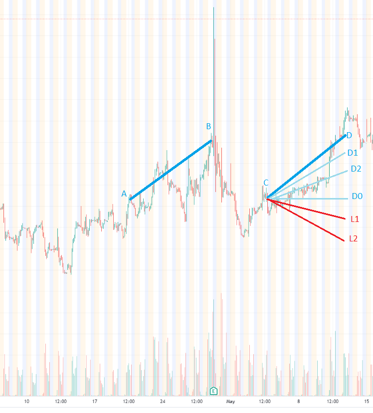

# FinancialCalculators
A set of javascript pages implementing Financial Instruments calculations
# Option valuation Calculator.
Why make your own options calculator when there is a good one here https://www.optionseducation.org/toolsoptionquotes/optionscalculator ?
The matter is that this calculator gives calculation only for one point. If we wish to open a position with option(s) we would like to know how our position will develop over time as we approach the expiraton and how it will depend on the path of the stock.
Let's say we want to play through an option on Amazon shares. Let us be at point C in time. To determine when and where the stock will go approximately, let's consider the path of this stock in the past: line AB. This will give us the holding time and the maximum percentage by which the stock will rise. However, other cases should be calculated as well: if the stock falls by the same percentage (CL2), and if the price remains constant(CD0), as well as intermediate paths (CD1, CD2, CL1 ..).

### App structure and implementation Status
On the left side the following parameters are being entered:
  Interest Rate %    - current bank interest rate
  Ticker             - is not used for now, but in the future will be fetching the spot price
  Holding Period     - position holding period in days
  Spot Price         - price of the stock at starting moment
  Projected Price    - expected price in the end of holding period
  Projected %        - calculated field indicating projected growth/loss in percentage
  Buy/Sell           - choose buy or sell the option
  Call/Put           - choose call or put option type
  Expiration         - option expiration date (Fridays, not all fridays)
  Days to expiration - Calculated field based on Expiration date
  Volatility%        - Implied volatility in %
  Strike             - Option strike price
  Then below Calculate button there are Results fields for Option Price, Delta and Theta in the starting moment.
Currently single leg option position with holding period matching expiration date is implemented.
