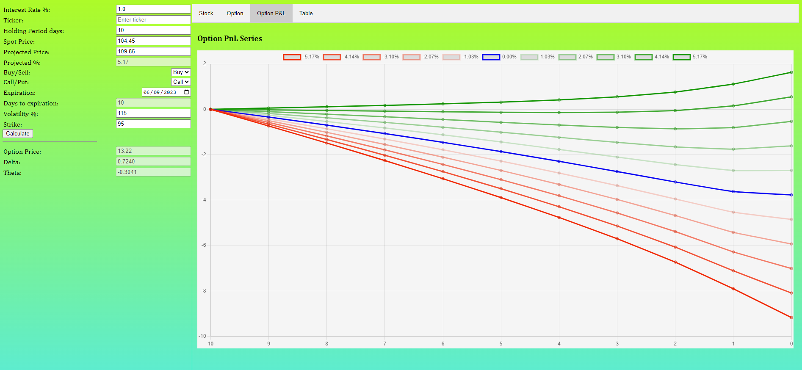
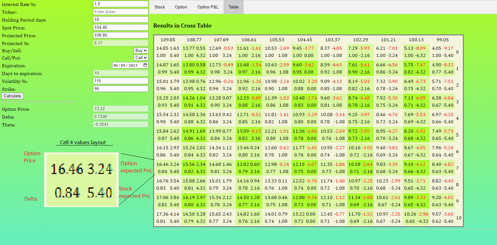

# FinancialCalculators
A set of javascript pages implementing Financial Instruments calculations
# Option valuation Calculator.
Why make your own options calculator when there is a good one here https://www.optionseducation.org/toolsoptionquotes/optionscalculator  
The matter is that this calculator gives calculation only for one point. If we wish to open a position with option(s) we would like to know how our position will develop over time as we approach the expiraton and how it will depend on the path of the stock.  
Let's say we want to play through an option on Amazon shares. Consider to use your favorite site for stock diagram. Let's say we are at point C in time. To determine when and where the stock will go approximately, let's consider the path of this stock in the past: line AB. This will give us the holding time and the maximum percentage by which the stock will rise. However, other cases should be calculated as well: if the stock falls by the same percentage (CL2), and if the price remains constant(CD0), as well as intermediate paths (CD1, CD2, CL1 ..).  

### App structure and implementation Status
On the left side the following parameters are being entered:
-  Interest Rate %    - current bank interest rate
-  Ticker             - is not used for now, but in the future will be fetching the spot price
-  Holding Period     - position holding period in days
-  Spot Price         - price of the stock at starting moment
-  Projected Price    - expected price in the end of holding period
-  Projected %        - calculated field indicating projected growth/loss in percentage
-  Buy/Sell           - choose buy or sell the option
-  Call/Put           - choose call or put option type
-  Expiration         - option expiration date (Fridays, not all fridays)
-  Days to expiration - Calculated field based on Expiration date
-  Volatility%        - Implied volatility in %
-  Strike             - Option strike price  
Then below Calculate button there are Results fields for Option Price, Delta and Theta in the starting moment.  
Currently single leg option position with holding period less or equal to expiration date has been implemented.
### Output Data Layout
Here is the Stock Series chart indicating the stock progress, X axis indicates how many days left to close the position or as depicted for the option to expire. Y - stock price.

On the Option Series chart the option price is indicated. The line colors correspond with the ones in Stock Series chart.

Same as previous, but shows up how much profit/loss is made.

indicates 4 measures per one cell: Option Price, Option Expected PnL, Delta and Stock Expected PnL. X - Stock Price and Y - Days to expiration or Days to closing position.

### Installation
No installation is required, just copy paste Index.html, script.js and style.css in any folder and open with a browser. I deliberately left all the code in script.js so the Index.html can be run without any additional hosting applications. From the architecture standpoint it is better to have the code properly separated by it's functionality.
### Future Features
- Need to have a capability to hedge first leg option with the second leg option. It will open oportunity to build vertical spreads and straddles
- Need to implement the case when holding period is greater than expiration day for one of the legs. That will open opportunity to build calendar spread.
